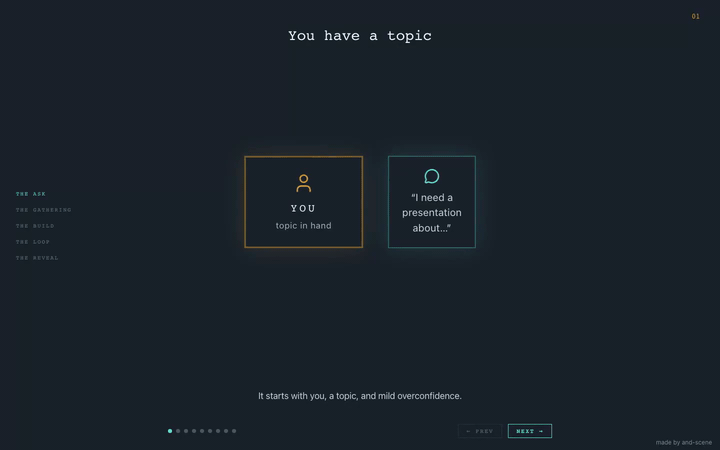

# and-scene

and-scene is a plugin for Claude Code and Codex that builds animated,
morphing slide presentations directly into your project: you describe the
presentation, the agent scaffolds a Vite/React app if needed, generates the
steps, and verifies they render.

An evolving-scene presentation is not a stack of unrelated slides. It is one
shared diagrammatic canvas where a stable set of entities **morph** across named
steps: boxes appear, move, connect, collapse, and re-label as the presentation
arc develops. The continuity between steps *is* the story.

This repo contains the plugin, the reusable scene kit source, and a worked
reference presentation you can run locally. Plugin users do not need to clone
this repo.

## Demo

These are video previews. Click a preview to open the MP4.

### How to make a presentation

[](docs/assets/and-scene-demo.mp4)

[Download the demo video](docs/assets/and-scene-demo.mp4)

### Evolution of the bicycle

[](docs/assets/evolution-of-the-bicycle-demo.mp4)

This bicycle demo was made by Claude Code with Opus 4.8.

[Download the bicycle demo video](docs/assets/evolution-of-the-bicycle-demo.mp4)

Both demo videos were inspired by [the original](https://www.codagent.dev/what-is-a-harness)
presentation. To run the bundled reference presentation locally, see
[Development](#development).

## Requirements

- Claude Code or Codex with plugin support.
- Node `^20.19.0` or `>=22.12.0`, plus npm, in the project where the
  presentation will live.
- A Chromium browser for `npm run verify` and `npm run inspect`. After
  installing dependencies, run `npx playwright install chromium` if your
  environment does not already provide one.

## Getting started

You use and-scene by installing its **plugin** and running its skill inside
**your** project. The scene kit is copied into your project as source you own;
see [How the kit reaches your project](#how-the-kit-reaches-your-project).

### 1. Install the plugin

For Codex:

```bash
codex plugin marketplace add Codagent-AI/and-scene
codex plugin add and-scene@and-scene
```

For Claude Code:

```bash
claude plugin marketplace add Codagent-AI/and-scene
claude plugin install and-scene
```

### 2. Create a presentation

Invoke the skill in your project:

```text
/and-scene:presentation
```

…or just ask in natural language (e.g. "create a presentation about …"). The
skill interviews you one question at a time, scaffolds any missing infrastructure
(stating the target and asking before it writes), generates the presentation, and
self-verifies that it builds and renders.

### 3. Work on the result

Scaffolding gives your project a Vite + React app with the usual scripts:

```bash
npm run dev        # http://localhost:5173
```

The dev server opens a **landing page** at `/` listing every presentation; each
lives at its own route (`/<slug>`).

## How the kit reaches your project

There is **no `npm install and-scene`**. The reusable **scene kit**
(`presentation-kit/`, ~650 lines) is **vendored** — the skill *copies* it into
your project as source you own and can edit, like
[shadcn/ui](https://ui.shadcn.com). You're meant to own its styling in your
presentation or app.

### Where the skill scaffolds

When your project is missing the presentation infrastructure, the skill resolves
*where* to put a self-contained app, then states the target and asks you to
confirm before writing:

| Your project | Scaffold location |
|--------------|-------------------|
| Empty directory, or an existing standalone JS app (root `package.json`) | Repository root (`.`) |
| Monorepo (`workspaces`, `pnpm-workspace.yaml`, or `packages/` / `apps/`) | Self-contained app under `presentations/` |
| Non-empty repo that is **not** a JS app (no root `package.json` — e.g. Python/Go/Rust) | Self-contained app under `presentation/` |
| Already has the infrastructure | Uses it in place; scaffolds only what's missing |

### Styling

The kit is BYO styles. It ships motion behavior, fixed-canvas layout plumbing,
and stable DOM hooks such as `data-node`, `data-node-part`, `data-accent`,
`data-variant`, and `data-presentation-*`; it does not ship a palette, font,
card treatment, button style, or Tailwind dependency. Style each presentation
with plain CSS, CSS modules, Tailwind, or whatever the host project chooses.

## Controls

Each presentation lives at its own route (`/<slug>`). In a presentation:

- **→ / Space / PageDown** — next step
- **← / PageUp** — previous step
- **P** — toggle **present** (title-only) ↔ **browse** (captions + table of
  contents). The step **title shows at the top in both modes**; browse adds the
  per-step caption and navigation along the bottom.

## Updating

Updating has two layers: refresh the installed **skill/plugin**, then resync the
**vendored kit copy** in each project that should receive kit fixes.

For Codex, refresh the marketplace snapshot:

```bash
codex plugin marketplace upgrade
```

For Claude Code:

```bash
claude plugin marketplace update and-scene
claude plugin update and-scene@and-scene
```

Refreshing the plugin does **not** change a project's existing
`src/presentation-kit/` copy. The easiest way to pull kit fixes into a project
is to ask the skill to "resync the scene kit".

If you prefer the raw command, run the sync script from the consuming project
root. Replace `<skill-dir>` with the directory that contains this skill's
`SKILL.md`; in this repository that directory is `skills/presentation/`.

```bash
node <skill-dir>/sync-kit.mjs            # show what changed (exit 1 if drift)
node <skill-dir>/sync-kit.mjs --apply    # rewrite the vendored copy to match
```

The script diffs the skill's bundled snapshot against your copy and rewrites it
on `--apply`. Local edits show up as drift, like `shadcn diff`; target-only files
are never deleted, so local-only additions survive. Review with `git diff`,
re-apply any theming the update overwrote, then rebuild.

## Scripts

Scaffolding adds these to your project:

| Script | What it does |
|--------|--------------|
| `npm run dev` | Vite dev server |
| `npm run build` | Type-check (`tsc -b`) and production build |
| `npm run preview` | Serve the production build |
| `npm run verify` | Build + render-check every registered presentation |
| `npm run inspect -- <slug>` | Capture screenshots for visual composition review |
| `npm run test` | Vitest unit tests |
| `npm run lint` | ESLint |

`verify` builds the app, then launches a headless browser against a production
preview and steps through **every** registered presentation, failing on any build
error, console error, or uncaught page error. (It needs a Chromium browser — run
`npx playwright install chromium` once.)

`inspect` builds the app, launches a production preview, and writes step
screenshots to `artifacts/presentation-inspection/<slug>/` so layouts can be
checked for overflow, unintended overlap, and chrome collisions.

## Tech

React 19 · TypeScript · Vite · [`motion`](https://motion.dev) for `layoutId`
morph animations · `lucide-react` for glyphs. Styling is presentation-owned;
Tailwind can be added by a host project, but it is not required by the kit.

---

## Development

### Run the reference app

```bash
npm install
npm run dev        # http://localhost:5173
```

The landing page at `/` lists every registered presentation. The bundled
reference presentation — which itself explains how the skill builds a
presentation — lives at:

```
http://localhost:5173/how-to-make-a-presentation
```

Run `npm run verify` to build and render-check every presentation, and
`npm run test` for the unit tests.

### Repository layout

```
src/                         The reference app
  presentation-kit/          CANONICAL scene kit: Presentation, Stage, chrome,
                             node primitives (Box, Arrow, Frame, …), navigation
  presentations/
    index.ts                 Registry — one entry per presentation (slug → loader)
    <slug>/                  A self-contained presentation (entities/steps/Talk)
  Root.tsx, router.ts        Zero-dependency pathname router + landing page
scripts/verify.mjs           Build + render verification (Playwright)

skills/presentation/         The agent skill
  SKILL.md                   The skill contract + procedure
  scaffold.ts                Anchor detection + scaffold-target resolution
  templates/
    bootstrap/               A full app shell, incl. a SNAPSHOT COPY of the kit,
                             stamped into a fresh/empty project
    presentation/            A single-presentation template
    single-step/             A single-step template
```

### Two copies of the kit, on purpose

`src/presentation-kit/` is the canonical kit the reference app runs.
`skills/presentation/templates/bootstrap/src/presentation-kit/` is a snapshot the
skill copies into your project. They are kept byte-identical (excluding tests) —
when the canonical kit changes, the snapshot must change identically.
`skills/presentation/kitSnapshot.test.ts` enforces this in `npm run test`; resync
with `node skills/presentation/sync-kit.mjs --apply`.
